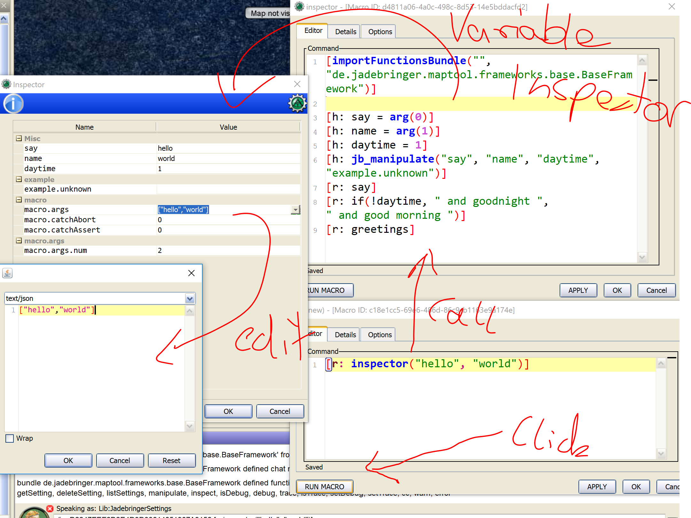

# MapTool-jadebringer-extension

MapTool-jadebringer-extension is an extension for [MapTool](https://www.rptools.net/toolbox/maptool/) (by RPTools.net). MapTool 
is a full and free Virtual Table Top application. The extension bring new functionality 
for MapTool. 

The extension is mostly about new functions for the MapTool macro language. Goal is 
to make writing macros more convenient/easier and allow doing stuff that is not possible with "just" 
official MapTool yet (like the button frames). Safety and security goes first, so you 
will not be able to do "dodgy" stuff inside or outside of MT with the extension.

While we will contribute to the official MapTool where possible, not all features in this repo will be merged into the official repo. If you want to have them, get this extension.

### But what's Jadebringer?

This MapTool Jadebringer extension is a generic extension with additional functionality that everyone can use.

The name Jadebringer derives from the Role Playing System Jadebringer Midwinter Chronicles
based on the Midwinter Chronicles Fantasy novels.
More info on [jadebringer.de](http://www.jadebringer.de)

## Screenshots

### Button frames example
	

### Variable inspector/manipulator example
    

## Features for everyone

- shows chat in fullscreen
- shows initiative in fullscreen
- center map with `/call maps_center`
- show the whole map with `/call maps_extent`
- have some build in buttons (e.g. for center map) by calling `/call frames_showAllFrames`

## Features especially for macro developers

- have a `/call functionName(parameters)` chat macro to call any function via chat
    - try with `/call frames_showAllFrames` followed by a later `/call frames_hideAllFrames` ;)
- use new button frames in window mode and in fullscreen 
    - can be dragged, resized, minimized
    - have buttons to call macros with title or icon
    - buttons can be created, deactivated or hidden via macros
    - control the frame/buttons with macros
    - check all the new `frames_` functions in macro editor
    - Example
      ~~~
      <!-- create a button: -->
      [h: frames_addButton("testMacro@Lib:MyToken", "testbutton", "Test Button", "test the button", "simple tests", "testing", "", "", 0, 1)]
      <!-- show the frame: -->
      [h: frames_showFrame("testing")]
      <!-- add an existing asset id for a image in here: -->
      [h: frames_setButtonImage("testbutton", "simple tests", "testing", "", "asset://900021383d556b3f3946feb487b50550")]
      <!-- change button text: -->
      [h: frames_setButtonText("testbutton", "simple tests", "testing", "", "on my command")]
      ~~~
    - Button frames for existing macros can be automatically created. Just call:
      ~~~
      frames_autoCreateFrames(nameRegEx, zoneRegEx [, frameName])
      ~~~
      This scans macros if they have a line like `[h:'GM-macro,NAME,GROUP,TOOLTIP']`
        or `[h:'ALL-macro,NAME,GROUP,TOOLTIP']` as 1st line. If yes it will auto create 
          frames. Afterwards show the frame with `frames_showFrame("frameName")`.
- inspect and manipulate variables in macros
    - via `debug_inspect(variableNames)` or `debug_manipulate(variablesNames)`
    - other debug related functions as `debug/trace/warn/error`
- build in `outputTo(to, text)` function
- new Events in macros
    - just put a `onHandleEvent` macro on a lib:token (like the existing onTokenMoved) and 
    it will get called in case of one of the new events
    - to try out this new feature put this in a new onHandleEvent macro on any lib:token
      ~~~
      [outputTo("self", "Event: "+macro.args)]
      ~~~
    - Zone events: 
        - `Zone Activated` if a map was changed
    - Initiative events: 
        - `Initiative current` changed, 
        - `Initiative round` changed, 
        - `Initiative Token added`, 
        - `Initiative Token removed`, 
        - `Initiative sorted` 
    - Token events: 
        - `Token moved` (if a token was actually moved, so move was not denied),
        - `Token added`, 
        - `Token removed`
- manipulate token on other maps safely
    - all functions using tokens can deal with tokens on any map, not just the current
- input dialog with yes/no/cancel buttons via inputYesNoCancel(...) 
- map macros to center map/show whole map area
    - `maps_center()`
    - `maps_extent()`
    - `maps_getExtent()`
- convenience functions for load/save content (any content type from token macros/properties/tables)
    - `content_load("mycontentMacro", "tokenMacro", "mytoken")`
    - `content_load("mycontent", "tokenProperty", "mytoken")`
    - `content_load("1", "table", "mytable")`
    - `content_save("mycontent", "tokenMacro", "mytoken", "any content")` 
- convenience functions for load/save settings in token properties
    - `listSettings`, `deleteSetting`, `setSetting`, `getSetting` 
- convenience functions to create macro links 
    - `links_createAnchor`
    - `links_createLink`
    - `links_execLink`   
- function to quickly call macros locally or on another client/player and define where to send the output
    - `macros_executeMacro("test@Lib:JadebringerSettings")`
    - `macros_executeMacroSendOutput("test@Lib:JadebringerSettings","	Oliver")`
    - `macros_sendExecuteMacro("userThatWeWantToRunTheMacro","please respond", "click here","test@Lib:JadebringerSettings","userOrChannelThatGetsTheResponse")`
    - of course works with existing auto execution of macros

Optional: the Java extension (more info for Java developers on request)
- extensions are bundles of call macros and macro function, so you can do more via macros and chat
- add call macros and macro functions via Java dynamically
- security build in, checks for trusted and that no not allowed code is executed
- additional feature: load Java extensions as java jars via file system or any URL

## How does it work?

It just adds new additions to MapTool. It is not changing any of the MapTool interns, 
nor (sorry, developer terms now) is it replacing classes/objects and no byte code manipulations. 
Simply just additions. It's even using aspects of the Java Security manager and Access 
Control Context to make sure new functions cannot do anything dodgy (like no file access, 
and mostly nothing else either - just calling MapTool public functionality).

If you just want to use the new functions/additions on your machines it's enough to 
follow the setup locally. If you are a GM and you write macros using the new functions 
that need to be run on the players side, the players need to install this as well.

## Requisites

The only thing you need to make this extension available in MapTool is the release artifact.
E.g. that's _MapTool-jadebringer-extension-v0.0.5.jar_
You can download one from the [releases](https://github.com/source-knights/MapTool-jadebringer-extension/releases) in Github or if you are a developer you can build 
it from source as described in the [BUILD](BUILD.MD) documentation.

And cause this is an extension you need to install [MapTool](https://www.rptools.net/toolbox/maptool/) (version 1.5.1 or higher) 
before. We might  go with a full fork of MT in the future, which means you would only 
install a special fork of MT with the extension included, but there are no plans for 
that yet.

## Install

You can use the existing installation of MapTool v1.5.1 or higher with this extension.
To have the additional functions just change the MapTool config file which you can find inside the MapTool installation directory, e.g. in

~~~

C:\Users\username\AppData\Local\MapTool-1.5.1\app\MapTool.cfg

~~~

Note: You might want to copy the file just in case that you do not want to use the extension 
anymore. If that is the case (we hope not) just copy this backup of the original file 
back and override the change file.

Now open the file and change the line with "app.classpath" to include the "MapTool-jadebringer-extension-v0.0.5.jar"

~~~
app.classpath=MapTool-1.5.1.jar;MapTool-jadebringer-extension-v0.0.5.jar
~~~

	

And the line with "app.mainclass" to match this:
~~~
app.mainclass=de/jadebringer/maptool/extension/LaunchInstructionsWrapper
~~~

Then copy the "MapTool-jadebringer-extension-v0.0.5.jar" inside this app directory. Now you can start MapTool as usual.

## First steps

To see if the extension was correctly setup you can now open MapTool as usual 
and type 

~~~

/call ping

~~~

in the chat. This should output the used version of the MapTool-jadebringer-extension. 
Don't worry if it does not match the filenames version. This will show an internal version 
of the jadebringer-base-extension.

~~~

/call frames_showAllFrames

~~~

This will open all the button frames that the jadebringer extension defines by 
default. Have fun clicking on then. These are examples what you can do with button frames 
using macros yourself.

All other changes are basically new functions for use in macros. So feel free to create 
or modify a macro and use the macro editor auto completion feature to see them.

E.g. type "frames_" followed by CTRL-space (or CMD-space on Mac) and you will see all the button frames related functions.

Have fun ;)

## Questions

Any questions? Feel free to message to _naciron_ in the official [MapTool discord](https://discord.gg/crpk7FM).
In there you can have live chats with the devs from this extension and also the official  team behind MapTool. 
Or email to contact (AT) jadebringer . de

